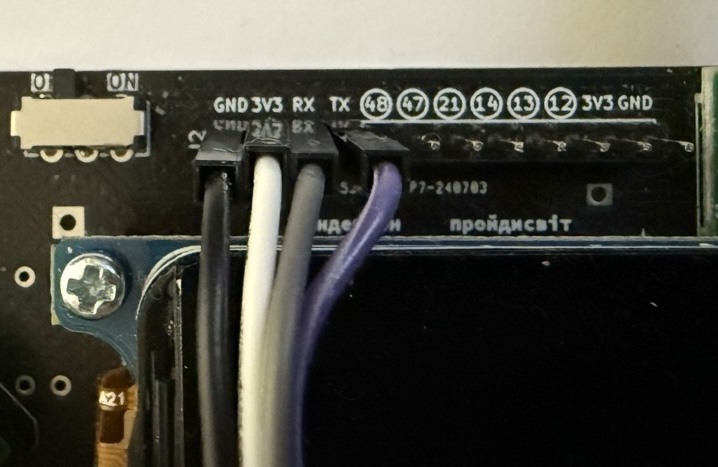
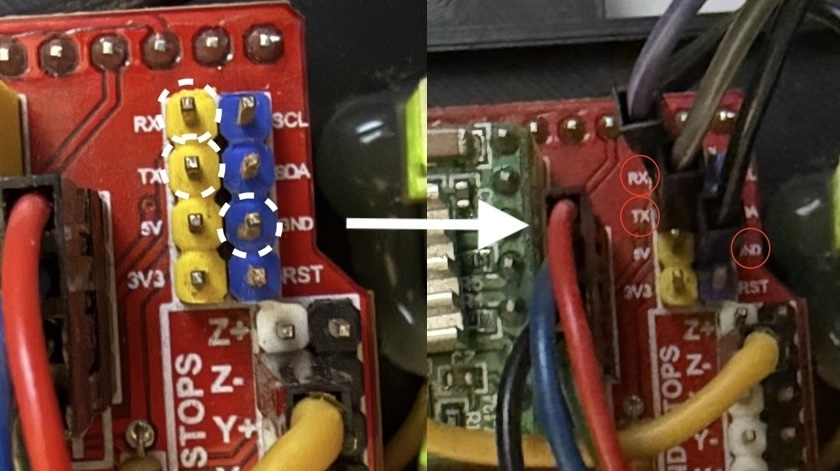

Кастомна прошивка для консолі Лілка https://github.com/and3rson/lilka щоб керувати CNC на базі GRBL прошивок.

Дана прошивка дозволяє:
[X]] ручне керування по X, Y осям ✅
[X] відкриття файлу з sdcard та запуск 
[X] статус GRBL контроллера та відображення помилки
[ ] зупинка, пауза та відновлення роботи

## Підключення

Маючи grbl плату підключити до пінів

Якщо плата використовує більше ніж 3.3v потрібно використовувати перетворювач логічних рівнів (наприклад https://arduino.ua/prod1141-two-channel-iic-i2c-logic-level-converter ~16грн)

| Лілка v2 | Grbl board |
| - | - | 
| 3v3  | не підключати, якщо Лілка має своє живлення через usb або батарею |
| RX | TX |
| TX | RX |
| GND | GND |
|  |  |

## Запустити

Завантажити .bin та .elf на карту, та запускати напряму з карти

## Використовується

Використовується бібліотека https://github.com/shah253kt/ESP32-GRBL-Parser